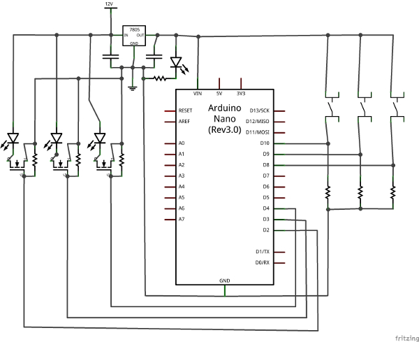

About
-------
An attempt at adding some arduino based extensions to an IKEA toy kitchen to give some interactive lighting. 

We got a toy kitchen for our children, actually it is the [Ikea Duktig][] but this would apply equally to any other toy kithen, 
and after wiring one of my [kitchen cupboards][] for some white LED lights I had some left over and thought a stip of lights would enhance the kitchen a little and make it more exciting.

Then I had the thought that some coloured LED strips would look great in the microwave and oven parts of the kitchen, and so this project began. 

I could have simply used push-on-push-off switches and skipped the whole microcontroller part, but I wanted the lights to turn themselves off so I didn't have to keep doing it, 
the original kitchen's hot plates already do this to save batteries. I also thought it might be fun to try and add some sound effects, like the microwave beping when done, 
which also would need the microcontroller.

### Circuit layout

The schematic is provided in a [Fritzing file][]. The schematic should be considered a guide as the pins do not match those used in the code.
 Also note that while the [Fritzing file][] has a stripboard layout and half a pcb design, I wouldn't rely on either to be accurate. 
This is my first project using Fritzing and probably my last as moving between the different layouts seems to be buggy and results in it wanting to add extra links or traces where there (as far as I can tell) shouldn't be any.

### Key parts
In the above circuit diagram the following parts where what I used, though of course you could equally use any other compatible part
 * Arduino - I opted for a [Nano V3][] from Bang Good as they are only a few quid
 * Linear voltage regulator - the LEDs are 12v, but the arduino runs on 5. I used a [L78M05CV][]
 * n-MOSFET - needed to switch the 12v lights from the 5v arduino - a [BS170][] fits the job
 * some resitors and capacitors are needed in the schematic, probably any value will do fine. I used whatever I had most of lying around
 * LED strips! these are obviously the main part of this project - I recommend checking out ebay or [Bang good led strips][]. One thing to note is that the specific orange and red strips I bought arrived as normal RGB strips with fixed wiring and resistors to make the desired colour, so you could just buy the RGB ones and fix the colour yourself.

License
-------
Released under the [MIT license][].

[MIT license]: http://anton.mit-license.org/
[Fritzing file]: ToyKitchenWiring.fzz
[Ikea Duktig]: http://www.ikea.com/gb/en/catalog/products/S49874533/
[kitchen cupboards]: https://www.strangeparty.com/2015/03/10/diy-led-cupboard-lighting/
[[Nano V3]: http://www.banggood.com/ATmega328P-Arduino-Compatible-Nano-V3-Improved-Version-With-USB-Cable-p-933647.html
[L78M05CV]: http://cpc.farnell.com/stmicroelectronics/l78m05cv/ic-v-reg-5-0v-78m05-to-220-3/dp/SC10578?CMP=TREML007-004
[BS170]: http://cpc.farnell.com/fairchild-semiconductor/bs170/mosfet-n-to-92/dp/SC06956?CMP=TREML007-004
[Bang good led strips]: http://www.banggood.com/Wholesale-LED-Strip-Lights-c-2528.html
